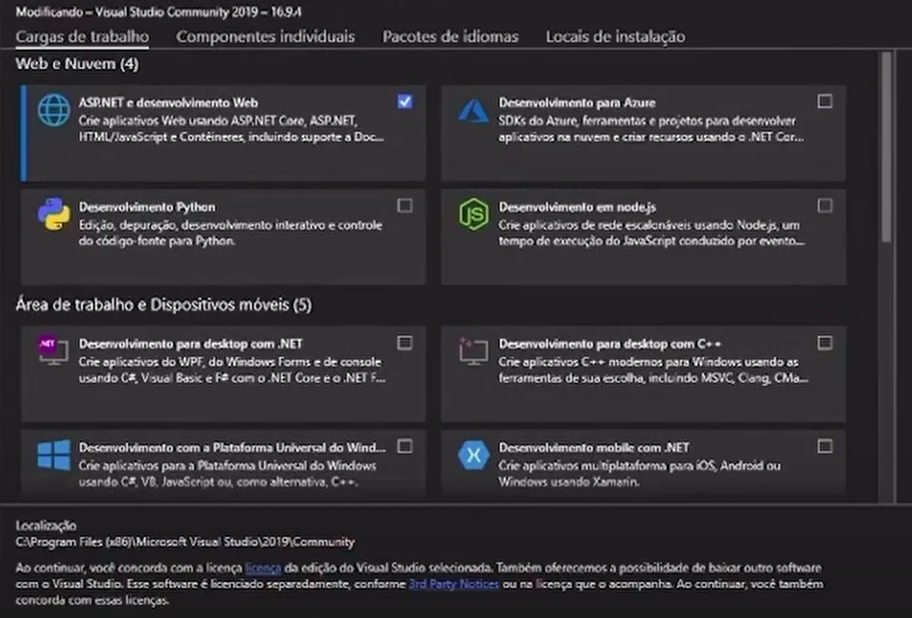
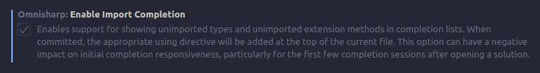

# Instalação Visual Studio (Windows)
Importante citar que o Visual Studio possui funcionalidades extras e uma maior compatibilidade com o .Net e C# em comparação ao VS code.
É possível fazer sem, mas, como você verá no próximo topico, poupa um trabalho de se ter de ficar configurando.

- Acesse o link https://visualstudio.microsoft.com/pt-br/downloads/
- Baixe a versão comunidade.
- Durante a instalação, você irá se deparar com a seguinte tela:



- Como na imagem, marque apenas a opção ASP.NET. A barra a direita de detalhes da instalação pode ficar como está.
- Continue a instalação normalmente.

# VS code
Caso decida por fazer a atividade no VScode, existem algumas extensões que podem melhorar a experiência na construção de APIs, como as extensões: C# e C# Extentions.

A extenção C# possibilitará a importação automática, debug, entre outras funcionalidades, e a C# Extentions permite criar uma classe ou interface nova rapidamente.

Mais informações sobre suas funcionalidades estarão em suas respectivas paginas que podem ser acessadas diretamente pelo VSCode, mas focaremos na importação automática e criação de classes.

Após a instalação da C#, para habilitar a importação é necessário ir em suas configurações e marcar a seguinte opção: 



Ao se digitar no codigo algo que não está importado, aparecerá a opção de autocomplete, que, se selecionada, também importará automaticamente a biblioteca necessária.

Para a criação de classes automaticamente, é só clicar com o botão direito na pasta desejada e clicar na opção.


## Solução de Problemas
#### 1. Caso a extenção C# apresente o erro **OmniSharp.MSBuild.ProjectManager Attempted to update project that is not loaded**,

- No menu do vscode, vá em File/Preferences/Settings.

- Na barra de pesquisa, digite omnisharp.path

- Clique em "Edit in settings.json"

- Adicione(ou edite) como: "omnisharp.path": "latest".

#### 2. Se você perceber que, no canto inferior esquerdo do seu vscode, há um icone de fogo em vermelho, dizendo que a extenção C# precisa da instalação do .net, instale o dotnet pelo link apresentado.

- Caso esteja no linux, o link é  https://docs.microsoft.com/en-us/dotnet/core/install/linux?WT.mc_id=dotnet-35129-website 

Se mesmo após os passos apresentados continuar dando algum erro, não hesite em pedir ajuda a algum membro da eccjr.

# Instalação Postman

Para dar sequência à atividade, será usado o Postman, uma ferramenta que nos auxiliará a fazer requisições http.

Para fazer o download do Postman no windows, vá no link: https://www.postman.com/downloads/ 

Ou, se estiver no linux, utilize o comando

```
snap install postman
```

# Criação da Primeira API - POKEDEX
Segue o vídeo da implementação de uma API simples que permite requisições GET, GET com parâmetro e POST
https://youtu.be/arTEq2rxOqo

Projeto final da pokedex no github:
https://github.com/alexRicc2/Pokedex

# Atividade
Crie uma API de filmes com os métodos POST, GET e GET por id contendo:
- Nome do filme;
- Ano de exibição;
- Diretor;
- Nota(quantidade de estrelas por exemplo);
- Gênero.

Fique a vontade para adicionar os métodos PUT e DELETE(modificar filme existente e deletar), mas tenha em mente que estes serão abordados na próxima atividade, então sem pressa se estiver tendo muita dificuldade.