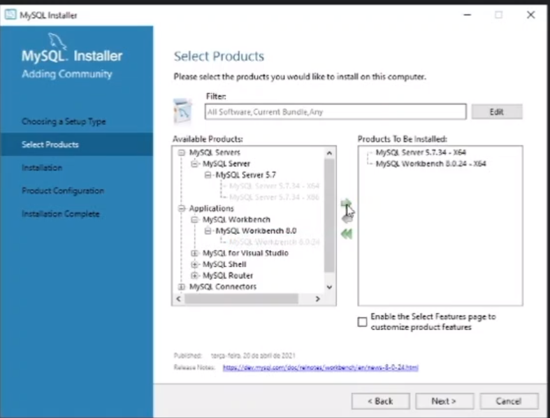

# Instalação MySql (Windows)

Na janela de instalação, selecione a instalação customizada.

Nela, selecione para instalar apenas o MySql Server 5.7.34, e o MySql Workbench 8.0.24.



Na hora de definir a senha, defina como root.

Após isso, continue a instalação normalmente.

# Instalação MySql (Linux)

Para instalar o MySql no Linux, rode o seguinte comando:
```
sudo apt install mysql-server
```

Depois, rode
```
sudo mysql -u root
```

Dentro do MySql que estará no terminal, digite os seguintes comandos: 
```
USE mysql;
UPDATE user SET plugin='mysql_native_password' WHERE User='root';
FLUSH PRIVILEGES;
exit;
sudo service mysql restart
```
Após isso, rode:
```
sudo mysql_secure_installation
```

Primeiro, ele vai perguntar se deseja instalar um plugin para enforçar senhas fortes. Digite N.

Depois, vai pedir para setar uma senha. Coloque a senha root.

Depois, perguntara sobre anonymous user. Digite N.

Depois, perguntara sobre conexão remota. Digite Y.

Depois, sobre uma database Test. Digite N.

E, por fim, se deseja atualizar agora. Digite Y.
# Implementação de Banco de Dados na API

Segue o video ensinando todos os passos para a implementação de um banco de dados em uma dotnet api: https://www.youtube.com/watch?v=D_wpM4DRZyQ

Nele é usado windows. Caso esteja em linux, abaixo estão as alternativas para alguns passos utilizados no processo.

# Instalação Pacotes Linux

Como o linux não possui VisualStudio, será usado o terminal para instalação dos pacotes.

Primeiro, instale o dotnet ef:
```
dotnet tool install --global dotnet-ef
```

Agora, para instalar os pacotes necessários:
```
dotnet add package Microsoft.EntityFrameworkCore
dotnet add package Microsoft.EntityFrameworkCore.Tools
dotnet add package MySql.EntityFrameworkCore
```

# Migração no Linux

Para fazer a migração do banco de dados que é citada no vídeo, rode:
```
dotnet ef migrations add CriandoTabelaPokemon
dotnet ef database update
```
No vídeo é também usada uma interface grafica para acessar o MySql. No linux rode o comando:
```
mysql -u root -p
```


# Atividade

Implemente o banco de dados na API de filmes da atividade anterior.
